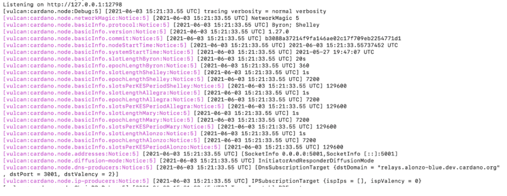

## Exercise 1

Download and install the correct version of the Cardano Node and CLI software.  

Note that we will be updating the software regularly to add features, fix bugs, improve performance, so you will need to use the correctly tagged version of the node at each stage.  

Unless you are already an expert, we do not recommend that you build binaries from source — we will not be able to help you if you encounter problems with the build.  Make sure that your search path includes the location for all the binaries that you have downloaded.

1. Verify your versions of cardano node and cardano cli:

		cardano-node –-version

		cardano-cli –-version

	or

		docker run cardano-node run --version

2. Create a working directory for your node instance.  Download the genesis files, topology file, and config file for the Alonzo Blue Testnet and store them in your working directory.  

3. Start the node using the configuration information that you have downloaded:

		cardano-node run \
		--topology path/to/alonzo-blue-topology.json \
		--database-path /db \
		--socket-path path/to/node.socket \
		--host-addr 0.0.0.0 \
		--port 3001 \
		--config path/to/alonzo-blue-config.json

**You are running a so-called “passive” node.  Your node will not participate in block production or verification, and it 	will connect to the dedicated IOG Testnet relay nodes to obtain information from the network.**

Make sure that you set the CARDANO_NODE_SOCKET_PATH environment variable correctly.  You may want to update your .bashrc or 	other configuration so this is done automatically in future.

Check that your instance of the node is properly connected to the Alonzo Blue Testnet and is fully synchronised.  You may 	need to wait a few minutes.  Use the relevant **cardano-cli commands** to query the tip of the blockchain.

Congratulations!  You have a working node connected to the first-ever public Alonzo Cardano network!

4. Use cardano-cli to generate payment keys and address
5. Request a “goody bag” containing a parcel of **test Ada** for use on the Testnet.
6. Log on to the dedicated Discord channel and introduce yourself.  In addition to your peers, you will meet IOG staff who are responsible for running the Testnet, stake pool operators who are responsible for producing blocks and ensuring that the Alonzo system works, community advisors and others.  Please follow the rules on good conduct!

The next full exercise (Exercise 3) will involve building, signing and submitting simple Plutus transactions using your own node.  

Before then, you might want to participate in the Hard Fork Event using the optional Exercise 2.

**Please let us know of any problems that you have encountered**

Via the Discord Channel for general questions.
Via the issue tracker at [https://github.com/input-output-hk/cardano-node/issues](https://github.com/input-output-hk/cardano-node/issues) for any bugs.

KH @ 3/6/21
